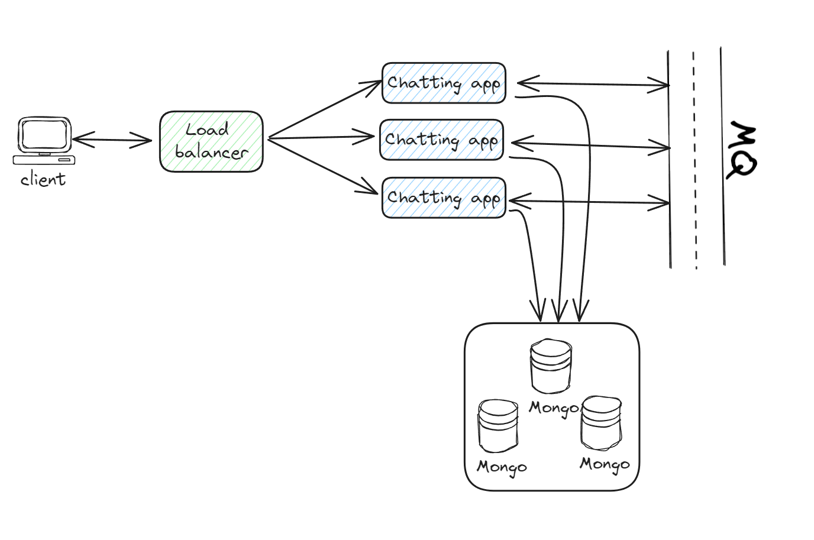

# AppChat
A chatting application made with FastApi + React + Message Queue

Task(backend)
- [ ] Connect FastApi with Mongo
- [ ] Make Models
- [ ] Find a mechanism to connect websocket and topics
- [ ] Select and Implement MQ

my goal is to do this let's see where it goes 
